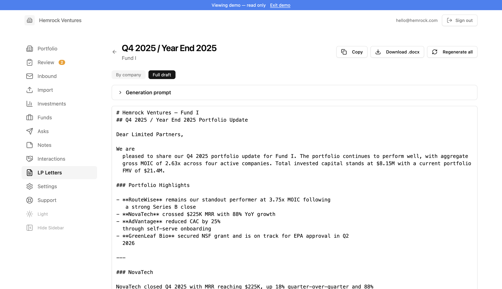

# Feature descriptions

- Project overview at [README](./README.md)
- Detailed feature descriptions at [FEATURES](./FEATURES.md)
- Technical deployment details at [DOCS](./DOCS.md)

## How It Works

The fastest way to get data flowing is to forward reporting emails to the inbound address shown in Settings. You can forward emails yourself, or give the inbound address to your founders or fund analysts and ask them to CC or send reports directly. Every email that arrives at that address is automatically parsed: the system identifies which company it's from, extracts the metrics you've defined, and flags anything it's unsure about for your review.

Not everything arrives by email. When someone sends you a link to a Google Sheet, Docsend deck, or any other hosted file, download it and upload it through the Import page. The same goes for PDFs, Excel workbooks, Word docs, PowerPoint decks, CSVs, and images — anything you can download, you can import. The AI pipeline processes uploads identically to inbound emails.

Once data starts flowing, the Portfolio dashboard gives you a real-time view of every company, the Review queue catches anything that needs a human decision, and the Analyst — available on every page — lets you ask questions about company performance, portfolio trends, and investment data through a persistent chat interface that remembers past conversations.

## Portfolio

The Portfolio page is the main dashboard and your starting point for monitoring the fund. It shows all active companies with key headline metrics (such as MRR and cash balance) so you can quickly scan the health of the portfolio without clicking into individual companies. Companies are displayed as cards with their most recently reported figures, sparkline charts, and badges for stage, industry, and portfolio group.

Filter by portfolio group and sort by name, cash position, or other criteria. A shared notes section at the bottom lets team members post fund-level observations — market commentary, cross-portfolio themes, reminders for the next IC meeting.

### Company Detail

Clicking a company opens its detail page. At the top you'll see the company name, headline metrics, and badges for stage, industry, and portfolio groups. Admins can edit the company's name, aliases, stage, industry, founders, overview, and other details.

The **Analyst** card generates a summary based on all available data — reported metrics, email content, uploaded documents, and previous summaries. The AI acts as a senior analyst preparing a portfolio review memo: it highlights current performance, trends, strengths, risks, and follow-up questions. You can regenerate the summary at any time, clear it to start fresh, or upload additional context documents directly from the card. If your fund has multiple AI providers configured, a provider selector lets you choose which AI to use.

Below the Analyst is the **metrics section**, where each metric has its own chart card. Charts show data points over time, color-coded by confidence level. Click any data point to view details and edit or delete values. You can also add data points manually using the "Add" button on each card. An export button lets you download all metric data as a CSV.

A **documents section** lists all files associated with the company — both uploads and email attachments. These documents are available to the Analyst when generating summaries. Individual file uploads are limited to 20 MB.

The **Investments section** tracks the fund's transaction history with the company — investment rounds, proceeds from exits or distributions, and unrealized gain changes. It displays summary metrics (total invested, FMV, MOIC, total realized) along with a detailed transaction table.

A **notes panel** on the right side lets your team leave company-specific observations visible to all members.

## Review

When inbound emails are processed, the AI pipeline sometimes flags items that need a human decision. These appear in the Review queue. Common reasons: a new company name was detected, a metric value was extracted with low confidence, a reporting period was ambiguous, or a metric couldn't be found in the report.

Each review item shows the issue type, the extracted value, and context from the source email. You can accept the value as-is, reject it, or manually correct it. For new company detections, you can create the company or map it to an existing one.

The review badge in the sidebar shows how many items are waiting. Once all items for an email are resolved, its status moves to "success." The system is designed to err on the side of flagging rather than silently writing bad data.

## Inbound

Inbound shows every email received and processed by the system — the audit trail for all automated report ingestion. Each row displays the sender, subject line, matched company, and processing status. Filter by status and date range, and click any email to see the full processing result: identified company, extracted metrics, review items, raw email body, and attachments.

If an email failed processing, you can see the error in the detail view. For emails needing review, resolve flagged items directly from the detail page. A **Process Email** action lets you rerun the entire AI pipeline on an email — useful after adding companies, updating metrics, or changing AI providers.

If file storage is connected (Google Drive or Dropbox), emails and attachments are saved into company-specific folders automatically.

## Import

Import lets you process reports manually when they arrive outside the normal email flow. Upload file attachments (PDFs, Excel spreadsheets, Word documents, PowerPoint decks, CSV files, and images up to 20 MB each), paste email text directly, or combine both. The system runs the same AI pipeline as automated inbound processing.

You can also paste data covering multiple companies at once — rows from a spreadsheet or CSV. The system will parse the data, create new companies if needed, add new metrics, and populate values. This makes it easy to bulk import historical data or onboard an entire portfolio in one step.

Investment transaction data can also be pasted — rounds, proceeds, valuations, and share prices — and the AI will match entries to your portfolio companies.

Fund cash flow data (commitments, called capital, distributions) can be pasted in freeform format — the AI parses dates, amounts, flow types, and portfolio group assignments automatically.

## Investments

The Investments page provides a fund-level view of all investment transactions across the portfolio. Two tables organize the data:

**Portfolio group summary** — one row per portfolio group (e.g. Fund I, Fund II) showing aggregate invested capital, current cost, realized and unrealized values, total value, gain/loss breakdowns, gross MOIC, realized/cost MOIC, unrealized/cost MOIC, and gross IRR. When fund cash flows are configured, computed LP metrics (TVPI, DPI, RVPI, Net IRR) appear alongside each group.

**Company detail table** — every company with its investment cost, current cost, proceeds, unrealized value, total value, MOIC, IRR, and percentage allocation. The first column (company name) is sticky during horizontal scrolling. Both tables support column sorting, and a group filter lets you focus on a single portfolio group.

Realized/Cost MOIC is calculated as realized proceeds divided by the cost basis exited. Unrealized/Cost MOIC is unrealized value divided by current cost (total invested minus cost basis exited). These provide a more precise view of returns relative to the capital actually at work, rather than total invested capital.

## Funds

The Funds page tracks fund-level cash flows and computes LP return metrics per portfolio group. Each portfolio group gets its own tab showing:

**Summary cards** — Committed Capital, Called Capital (PIC), Uncalled Capital, Distributions, Net Assets (editable — represents cash and other assets held by the fund excluding investment portfolio value), Gross Residual (investment unrealized value plus net assets), Net Residual, Total Value, TVPI, DPI, RVPI, and Net IRR.

**Cash flow table** — chronological list of all fund cash flows (commitments, called capital, distributions) with cumulative running totals for committed, called, uncalled, and distributed amounts. Cash flows can be added, edited, and deleted inline.

**Per-group settings** — a settings dialog (pencil icon) lets admins configure carry rate and GP commit percentage for each portfolio group. The GP commit percentage represents the portion of called capital funded by the general partner, which is excluded from carried interest calculations. Carry is calculated only on the LP portion of profits above remaining LP capital.

Key calculations:
- **Gross Assets** = investment unrealized value + net assets
- **Estimated Carry** = carry rate × max(0, gross assets × LP share − LP remaining capital)
- **Net Residual** = gross assets − estimated carry
- **Net IRR** = XIRR of called capital (negative), distributions (positive), and net residual as terminal value

Cash flow data can be bulk-imported from the Import page using freeform text — the AI parses dates, amounts, types, and group assignments automatically.

## Letters

Letters helps you generate quarterly update letters for your limited partners. Using AI and your portfolio data — reported metrics, company summaries, investment performance, and team notes — the system drafts professional LP communications scoped to a specific portfolio group and reporting period.

To create a letter, select the year, quarter, portfolio group, and template. Optionally toggle "year-end summary" for Q4 letters and add custom instructions to guide the AI. A preview step shows the companies and data that will be included before generation begins. You can upload a previous LP letter (.docx or .pdf) and AI analyzes it to match your writing style, tone, and structure, or use the built-in default template. Templates are reusable across letters and managed from the Templates dialog on the Letters page.

The AI generates a narrative for each company in the portfolio group, drawing on reported metrics, recent trends, company summaries, investment data, and team notes. A portfolio summary table with investment performance is also generated. The full letter is assembled from these sections.

After generation, the letter opens in an editor with two views: "Sections" shows each company narrative individually for targeted editing, and "Full" shows the complete assembled letter. Edit narratives inline, regenerate individual company sections or the entire letter, and add per-company or global custom prompts to refine the output. Per-company prompts can either add to or replace the default generation prompt. When finished, export the letter as a .docx file for final formatting and distribution, or export directly to Google Drive if connected.

## LPs

LPs helps you track and report on your limited partner positions across snapshots. Each snapshot represents LP positions at a point in time — typically a quarter-end.

From the LPs index page, create a new snapshot with a name and optional as-of date. On the detail page, paste spreadsheet data into the import dialog and AI automatically parses it, matching columns to fields like investor name, entity, commitment, paid-in capital, distributions, NAV, DPI, RVPI, TVPI, and IRR. Investors, entities, and investments are created or updated automatically. Rows with zero commitment and no financial data are filtered out.

The snapshot detail page shows all investors with aggregated metrics. Expand an investor to see individual entity and portfolio group line items. All values are inline-editable: click a row to edit metrics, or click an investor name to rename. Investors can be grouped under a parent for consolidated reporting, and duplicate investors can be merged together. When a snapshot has multiple portfolio groups, a filter appears in the header to include or exclude specific groups from the view and totals.

Configure a header and footer for the snapshot's PDF reports via the Settings button. Click the document icon on any investor row to view their individual report, or use "Batch PDFs" to generate all investor reports at once. PDFs include the header, a metrics summary table, and the footer. You can also export the full snapshot dataset to an Excel file with all investors, entities, portfolio groups, and metrics.

## Compliance

Compliance helps fund managers stay on top of regulatory filings, tax deadlines, internal compliance requirements, and fund reporting obligations. It provides a calendar-based view of everything due throughout the year, tailored to your fund's specific profile and registration status.

Start by completing a short questionnaire about your fund — registration status, AUM range, fund structure, Reg D exemption type, state presence, and a few other details. The system uses your answers to automatically determine which compliance items apply, which need further review, and which you can safely dismiss. If your fund profile changes, update the questionnaire and the calendar adjusts accordingly.

All applicable items appear in a monthly calendar organized by deadline. Items are color-coded by category — SEC filings in amber, tax filings in green, internal compliance in blue, fund reporting in purple, state compliance in rose, CFTC in orange, and AML/FinCEN in red. Quarterly items like partnership expense reviews and access person disclosures appear in each quarter independently, so you can track and dismiss them separately. Certain event-driven filings like Form D and Blue Sky appear only in the months where your fund has committed capital entries, derived automatically from fund cash flows data.

When you finish a filing, mark it as done by dismissing it for the year or quarter. You can filter the view between active items, dismissed items, or all items to see what's been completed and what remains. An all-items view provides a comprehensive list of every compliance item organized by category, with each item showing its frequency, deadline, applicability, filing system, and any relevant notes or alerts.

Save links to filing portals, regulatory accounts, and reference documents alongside your compliance items. Each link can optionally be associated with a specific compliance item, and associated links appear on that item's detail card for quick access during filing season.

The system ships with a curated registry of compliance items covering SEC filings (Form ADV, Form PF, Form 13F, Schedule 13G, Form 13H, Form N-PX), securities offerings (Form D, Blue Sky), CFTC exemptions, California diversity reporting, tax filings (Form 1065, K-1s, Form 7004), internal compliance (access person disclosures, annual compliance review, privacy notice), AML/FinCEN requirements, fund reporting (quarterly financials, valuations), and partnership expense allocation.

## Asks

Asks lets you send reporting request emails to portfolio companies. Compose a message, select which companies should receive it, and send it out. The system tracks each request so you know what was sent and when.

The email composer supports a customizable subject and body. Each request is logged with its recipient list, send timestamp, and delivery results. When companies reply to your ask email with their report, those replies flow into the Inbound pipeline automatically.

## Analyst

The Analyst is an interactive chat interface available on every page — company detail, portfolio dashboard, investments, asks, and notes. Powered by AI, it acts as a senior venture capital analyst with full access to your data, answering questions, surfacing insights, and helping you prepare for board meetings and IC discussions.

> The Analyst feature, like all the AI features, are scoped to your LLM API keys, so your interactions, questions, and built context are kept within your AI and your database.

On a **company page**, the Analyst has access to that company's reported metrics, email content, uploaded documents, previous summaries, investment transactions, portfolio peer comparisons, and your team's internal discussion notes. Ask it to analyze performance trends, compare the company to peers, identify risks, draft summaries, or interpret financial data from reports.

On **portfolio-wide pages**, the Analyst has access to fund-level data across all companies — investment amounts, FMV, MOIC, and team discussion notes. Use it to compare companies, get portfolio-level insights, or surface cross-portfolio themes.

**Persistent conversations** — chat history is saved to your account. Close the panel, navigate away, or close the browser — click the clock icon to open your conversation history and resume any previous thread. Conversations are scoped: company chats stay with that company, portfolio chats have their own history.

**Conversation memory** — when you start a new conversation, the system summarizes your recent past conversations in the same context and injects them into the AI's prompt. The Analyst remembers what you've discussed before — key questions, conclusions, and concerns — without you needing to repeat context.

**Team notes as context** — the Analyst incorporates your team's internal discussion notes into its analysis, so it's aware of qualitative observations alongside the quantitative data.

## Notes

Notes are available on each company's detail page, on the Portfolio dashboard, and on the dedicated Notes page. They provide a lightweight way for team members to share observations, context, and follow-up items.

Notes support **@mentions** — type @ while writing to see a dropdown of team members. You can also **follow companies** to get notified about notes on companies you care about. Notification preferences (all notes, @mentions only, or none) are managed in Settings.

Team notes are also fed into the Analyst as context, so the Analyst is aware of your team's discussions when answering questions.

## Interactions

Interactions gives GPs a searchable log of all conversations and introductions with portfolio companies. BCC the fund's inbound email address on any conversation, and the system automatically classifies it as a CRM interaction — not a metrics report — using a simple heuristic: emails from fund members go to the interaction pipeline, emails from authorized senders go to the metrics pipeline.

For each interaction, AI generates a short summary, detects whether the email contains an introduction between parties, and extracts the names and context of anyone being introduced. Interactions are linked to portfolio companies when the AI can identify them from the email content.

The Interactions page shows all logged interactions with filter tabs for **All** and **Intros**. Each entry displays the date, linked company, subject, AI summary, and an intro badge when introductions were detected. Expand intro details to see names, emails, and context of introduced contacts.

On each company's detail page, a **Recent Interactions** section shows the latest interactions for that company, with intro entries highlighted. The fund's inbound email address is shown at the top of the Interactions page for easy copy-and-paste into BCC.

## Deals

Deals is the inbound side of deal flow — cold pitches, partner-forwarded intros, and scout submissions arrive at your existing inbound email address and get screened against your fund's thesis before they reach a partner's inbox.

Every inbound email runs through a content-aware classifier that decides between four destinations: **reporting** (portfolio metrics, the existing pipeline), **interactions** (CRM-style emails from fund members), **deals** (a company pitching the fund), or **other** (newsletters, recruiter spam, vendor pitches). Sender identity is a strong signal but not a hard rule, so a partner forwarding a cold pitch lands in Deals where it belongs, and a portfolio founder pitching a side project gets routed correctly. Below a configurable confidence threshold, items go to a Review queue with the top two predicted destinations for one-click resolution. Items labelled "other" go to an Email Audit log instead of being silently dropped.

For each pitch routed to Deals, a single AI call extracts company name, founder, intro source (referral / cold / warm intro / accelerator / demo day), referrer when applicable, stage, industry, raise size, a 100–150 word company summary, and a thesis-fit analysis with a fit score (strong, moderate, weak, out of thesis). Out-of-thesis pitches auto-archive and surface in a weekly digest email so partners can sanity-check without eyeballing every cold pitch. Founders can also submit pitches directly via a public form at a per-fund URL — no signup, file uploads supported, honeypot + rate-limited.

The Deals page lists active pitches as a sortable table or a kanban board (drag-and-drop across status columns: new, reviewing, advancing, met, passed). Click a pitch to see the summary, thesis-fit analysis, source email, attachments, founders, intro source, and a deal-scoped Analyst chat that knows the pitch and your thesis. Settings → Deals controls the investment thesis, screening prompt, public submission token, confidence threshold, optional routing-model override, Known Referrers list (scouts and friends-of-fund whose intros bias toward Deals), an Email Audit log of dropped items, and a Routing Accuracy dashboard showing manual reroutes per week as a drift signal.

## Diligence

Diligence is the pre-investment workflow: when a deal is worth real time, you create a diligence record, upload the data room, and run a schema-driven agent that ingests the documents, conducts external research, asks partner Q&A, drafts a structured memo, scores it per your rubric, and renders to Word or Google Docs.

The agent is operated by **seven YAML/MD configuration files** ("schemas") that partners edit per-fund through an in-app editor: instructions (operating manual), rubric (scoring dimensions), qa_library (partner Q&A pool), data_room_ingestion (per-document extraction rules), research_dossier (external research scope), memo_output (memo structure), and style_anchors (metadata for uploaded reference memos). The schema editor uses Monaco with inline YAML validation and version history; rolling back to a prior version is one click. Each fund seeds defaults on first use and customizes from there.

**Style anchors** are uploaded reference memos that teach the agent your firm's voice. Drop in 3–8 prior memos, tag each with vintage, sector, voice representativeness, and partner notes, and the agent uses them to match structure and tone during drafting. A confidence indicator (unavailable / preliminary / reliable / robust) reflects how many memos you've uploaded. Reference memos teach voice — they never supply facts to a new memo.

The agent runs in six stages, each producing structured output stored on a memo draft:

1. **Ingest** — classify each document, extract claims with provenance, run a gap analysis against expected document types.
2. **Research** — verify or contradict company-stated claims, build a competitive map (named-by-company vs. identified-by-research), compile founder dossiers, list research gaps.
3. **Q&A** — pull batches from the Q&A library, apply skip logic against ingestion + research, capture partner answers.
4. **Draft** — assemble paragraphs per the memo_output schema with paragraph-level source citations. Recommendation and team scoring are partner-only and can never be set by the agent (DB constraint enforces this).
5. **Score** — rate each rubric dimension; partner-only dimensions (e.g. team) get null score with the rationale field populated as supporting material.
6. **Render** — markdown (inline), `.docx` download, or native Google Doc.

The memo editor is a two-pane view: rendered memo on the left with inline citation markers and visual treatment for projections, unverified claims, and contradictions; paragraph inspector and a partner-attention sidebar on the right. Partners edit any paragraph (it flips to `partner_edited` origin), update rubric scores by hand, work through the attention queue (must-address / should-address / FYI), and finalize when ready — finalizing locks the draft.

Across all your active deals, the **Inbox** aggregates open partner-attention items so you can triage them in one pass instead of clicking through each deal. The **Analytics** view shows the agent funnel (created → ingestion → research → Q&A → draft → finalized → won) with drop-off percentages, time-in-stage medians, win/loss by sector, and throughput per lead partner.

Settings → Diligence has three controls: **Schemas** (the seven YAML editors), **Style Anchors** (reference memo library), and **Defaults** (per-deal and monthly token caps with current-month usage bar, plus per-stage AI provider overrides — e.g. cheap model for ingest, stronger model for draft).

## Settings

Settings is where the platform is configured. Most settings are admin-only, but all users can update their display name and enable two-factor authentication.

For admins, Settings covers: AI provider keys and model selection (Anthropic, OpenAI, Google Gemini, and/or Ollama for local models), fund currency, feature visibility (control which features are visible to everyone, admin-only, hidden, or off), inbound email setup (Postmark or Mailgun), outbound email providers (Gmail, Resend, Postmark, or Mailgun), file storage connections (Google Drive or Dropbox), the AI summary prompt, email templates for reporting asks, analytics (Fathom, Google Analytics, and custom scripts), authorized senders, team members and roles, and the signup allow-list. The **Deals** group configures the inbound-pitch screening flow: investment thesis, screening prompt, intake toggle, public submission URL, known referrers, routing confidence threshold, and optional per-stage routing-model override. The **Diligence** group has three sub-pages: Schemas (the seven YAML editors with version history), Style Anchors (reference memo library with text extraction), and Defaults (per-deal and monthly token caps, per-stage AI provider overrides). The current app version is shown at the bottom of Settings, with a link to the Updates page when a newer version is available.

