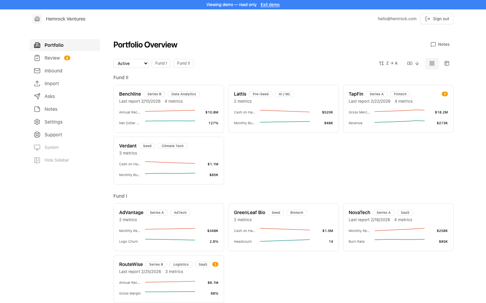
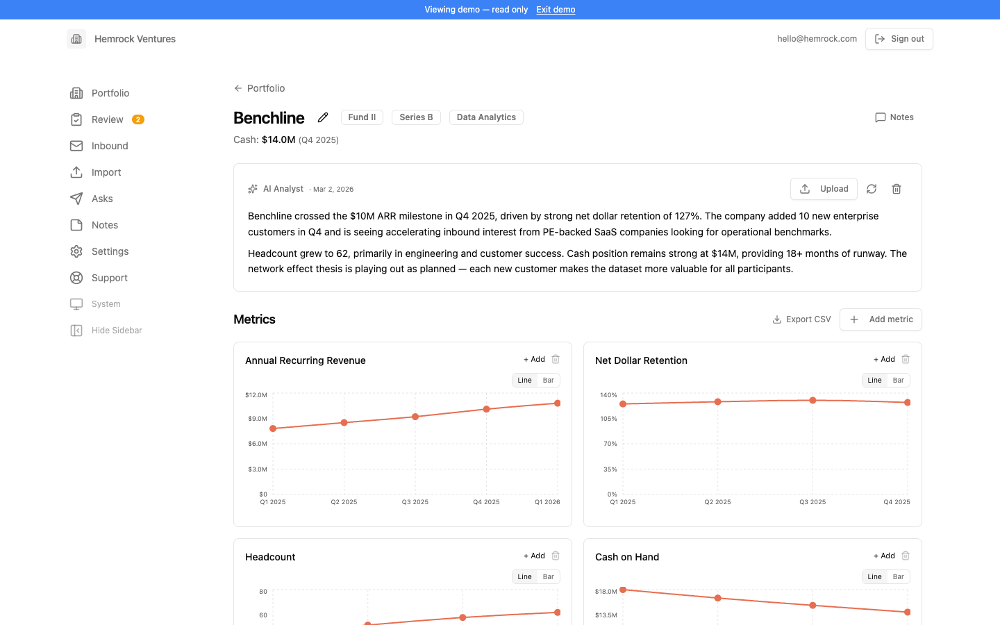
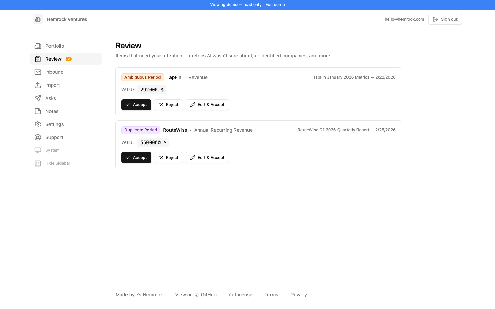
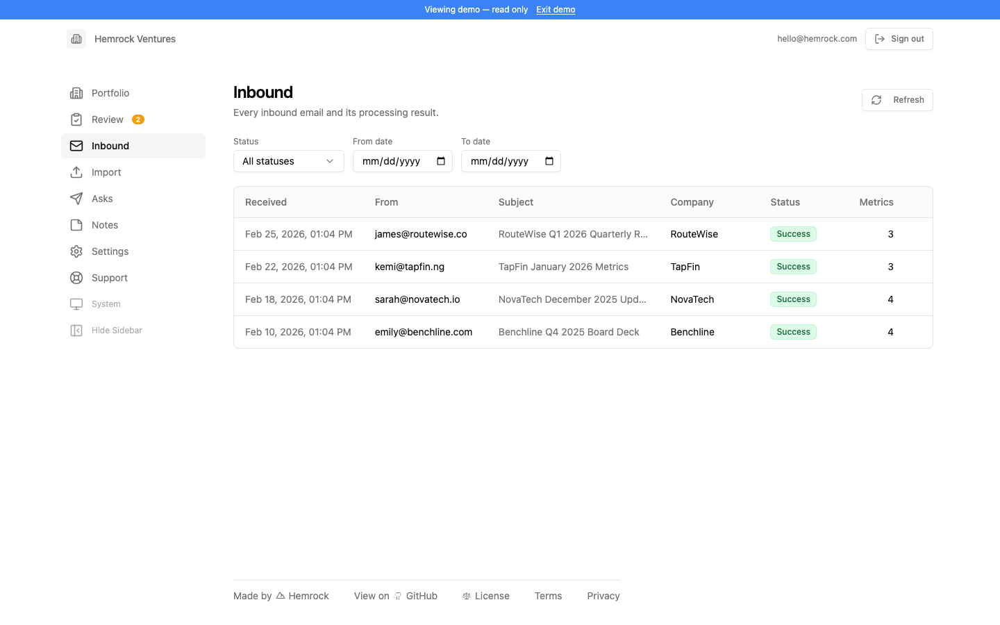
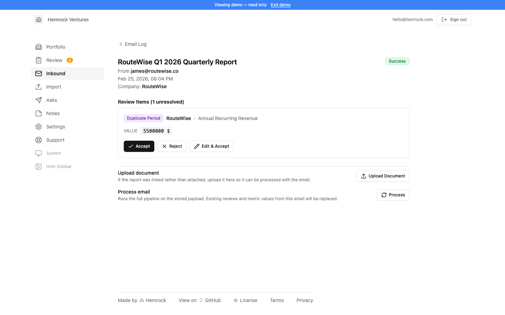
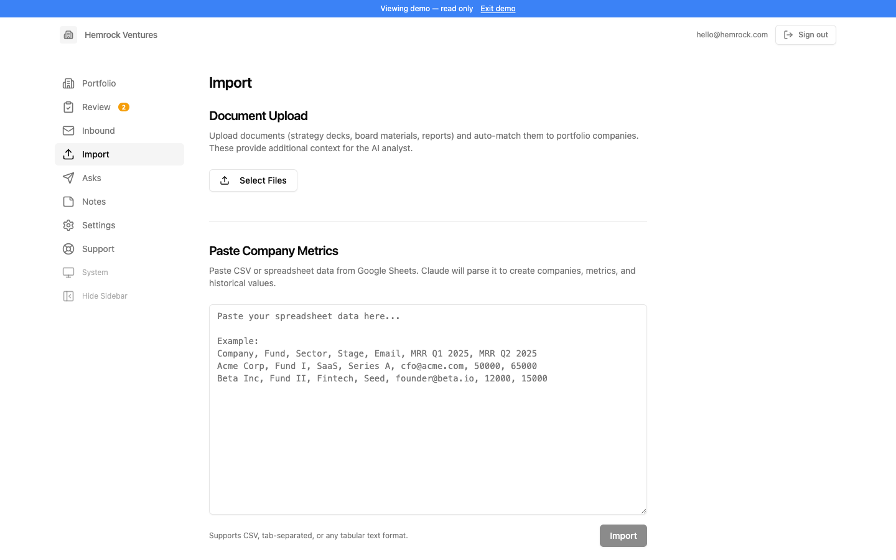
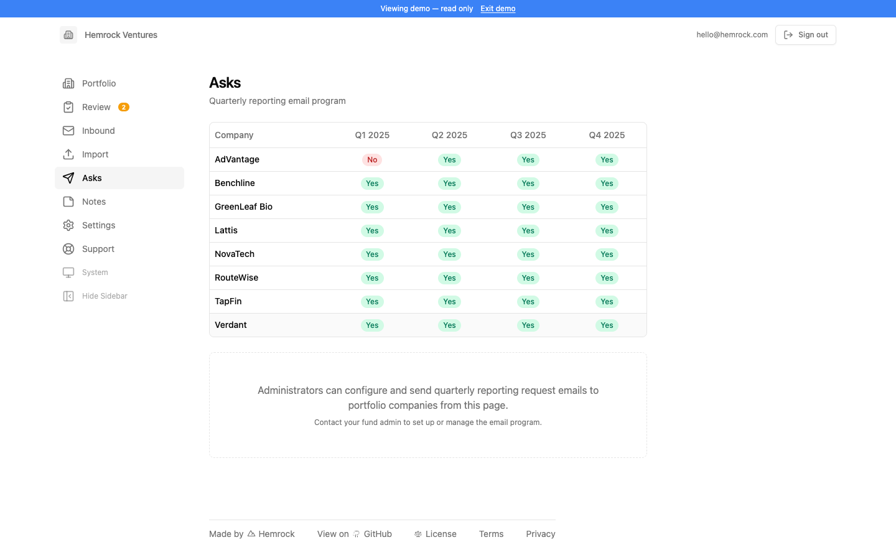
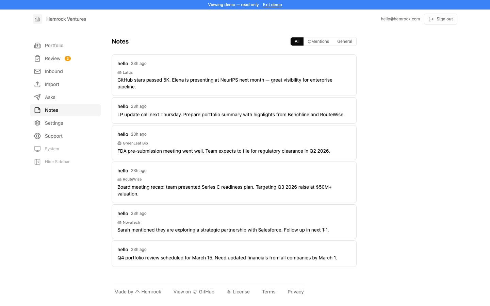
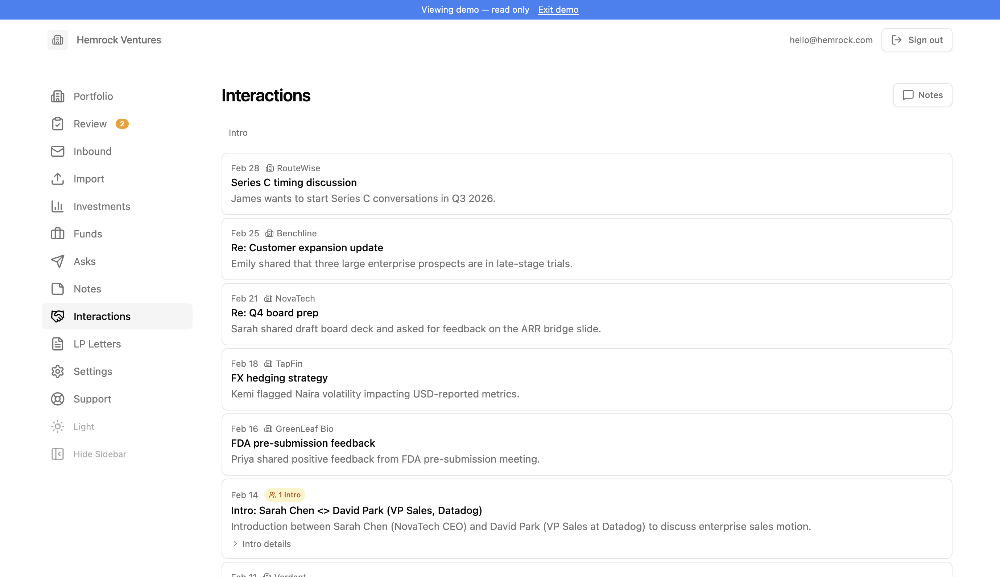
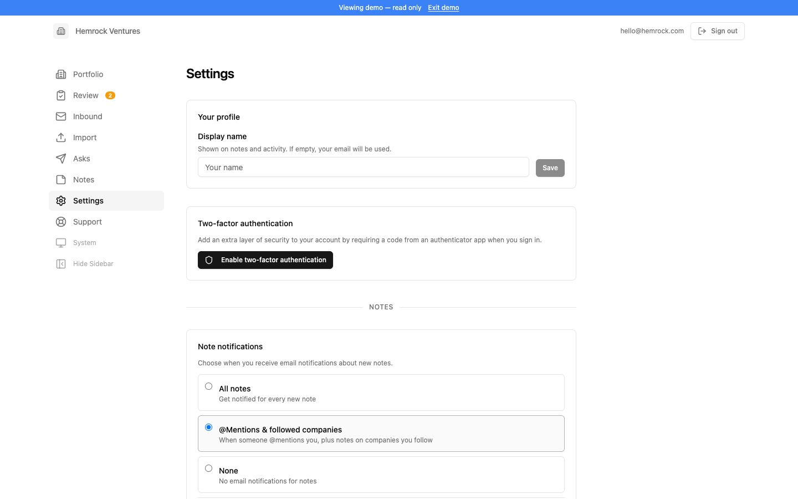

# Fund Portfolio Reporting

Portfolio reporting for venture capital firms, accelerators, and angel investors. Forward your investor updates in any format — PDF, Excel, PowerPoint, plain text — and AI identifies the company, extracts the metrics you care about, and creates an analysis of the current state of the company. Track investments at a per company, per fund, and overall perspective alongside your fund administrator. Lightweight CRM to track your intros, strategy guidance, qualitative value-adds. Complete your limited partner reporting process faster, easier, and better.

Built by Taylor Davidson at [Hemrock](https://www.hemrock.com). For setup assistance, managed deployments, or general questions, [contact Taylor](https://www.hemrock.com/contact).

**[Try the demo](https://portfolio.hemrock.com/demo)** — explore the platform with sample data, no signup required.

## Pricing & License

Self-hosted, operating this for yourself, this software is free to use if you are a single fund management company running your own operations — that includes all of your funds, SPVs, and internal team members. You can modify it and deploy it on your own infrastructure and on your own domain.

Managed deployments are available, [contact Taylor](https://www.hemrock.com/contact) if you want him to deploy this on your infrastructure and your accounts.

If you are a fund administrator, outsourced CFO, consultant, or service provider using this across multiple clients, you need a paid commercial license. You cannot resell it, white-label it, offer it as SaaS, or bundle it into another product.

See [LICENSE](LICENSE) for full terms. For commercial licensing, [contact Taylor](https://www.hemrock.com/contact).


## How It Works

The fastest way to get data flowing is to forward reporting emails to the inbound address shown in Settings. You can forward emails yourself, or give the inbound address to your founders or fund analysts and ask them to CC or send reports directly. Every email that arrives at that address is automatically parsed: the system identifies which company it's from, extracts the metrics you've defined, and flags anything it's unsure about for your review.

Not everything arrives by email. When someone sends you a link to a Google Sheet, Docsend deck, or any other hosted file, download it and upload it through the Import page. The same goes for PDFs, Excel workbooks, Word docs, PowerPoint decks, CSVs, and images — anything you can download, you can import. The AI pipeline processes uploads identically to inbound emails.

Once data starts flowing, the Portfolio dashboard gives you a real-time view of every company, the Review queue catches anything that needs a human decision, and the Analyst — available on every page — lets you ask questions about company performance, portfolio trends, and investment data through a persistent chat interface that remembers past conversations.

## Portfolio

The Portfolio page is the main dashboard and your starting point for monitoring the fund. It shows all active companies with key headline metrics (such as MRR and cash balance) so you can quickly scan the health of the portfolio without clicking into individual companies. Companies are displayed as cards with their most recently reported figures, sparkline charts, and badges for stage, industry, and portfolio group.

Filter by portfolio group and sort by name, cash position, or other criteria. A shared notes section at the bottom lets team members post fund-level observations — market commentary, cross-portfolio themes, reminders for the next IC meeting.



### Company Detail

Clicking a company opens its detail page. At the top you'll see the company name, headline metrics, and badges for stage, industry, and portfolio groups. Admins can edit the company's name, aliases, stage, industry, founders, overview, and other details.

The **Analyst** card generates a summary based on all available data — reported metrics, email content, uploaded documents, and previous summaries. The AI acts as a senior analyst preparing a portfolio review memo: it highlights current performance, trends, strengths, risks, and follow-up questions. You can regenerate the summary at any time, clear it to start fresh, or upload additional context documents directly from the card. If your fund has multiple AI providers configured, a provider selector lets you choose which AI to use.

Below the Analyst is the **metrics section**, where each metric has its own chart card. Charts show data points over time, color-coded by confidence level. Click any data point to view details and edit or delete values. You can also add data points manually using the "Add" button on each card. An export button lets you download all metric data as a CSV.

A **documents section** lists all files associated with the company — both uploads and email attachments. These documents are available to the Analyst when generating summaries. Individual file uploads are limited to 20 MB.

The **Investments section** tracks the fund's transaction history with the company — investment rounds, proceeds from exits or distributions, and unrealized gain changes. It displays summary metrics (total invested, FMV, MOIC, total realized) along with a detailed transaction table.

A **notes panel** on the right side lets your team leave company-specific observations visible to all members.



## Review

When inbound emails are processed, the AI pipeline sometimes flags items that need a human decision. These appear in the Review queue. Common reasons: a new company name was detected, a metric value was extracted with low confidence, a reporting period was ambiguous, or a metric couldn't be found in the report.

Each review item shows the issue type, the extracted value, and context from the source email. You can accept the value as-is, reject it, or manually correct it. For new company detections, you can create the company or map it to an existing one.

The review badge in the sidebar shows how many items are waiting. Once all items for an email are resolved, its status moves to "success." The system is designed to err on the side of flagging rather than silently writing bad data.



## Inbound

Inbound shows every email received and processed by the system — the audit trail for all automated report ingestion. Each row displays the sender, subject line, matched company, and processing status. Filter by status and date range, and click any email to see the full processing result: identified company, extracted metrics, review items, raw email body, and attachments.

If an email failed processing, you can see the error in the detail view. For emails needing review, resolve flagged items directly from the detail page. A **Process Email** action lets you rerun the entire AI pipeline on an email — useful after adding companies, updating metrics, or changing AI providers.

If file storage is connected (Google Drive or Dropbox), emails and attachments are saved into company-specific folders automatically.





## Import

Import lets you process reports manually when they arrive outside the normal email flow. Upload file attachments (PDFs, Excel spreadsheets, Word documents, PowerPoint decks, CSV files, and images up to 20 MB each), paste email text directly, or combine both. The system runs the same AI pipeline as automated inbound processing.

You can also paste data covering multiple companies at once — rows from a spreadsheet or CSV. The system will parse the data, create new companies if needed, add new metrics, and populate values. This makes it easy to bulk import historical data or onboard an entire portfolio in one step.

Investment transaction data can also be pasted — rounds, proceeds, valuations, and share prices — and the AI will match entries to your portfolio companies.

Fund cash flow data (commitments, called capital, distributions) can be pasted in freeform format — the AI parses dates, amounts, flow types, and portfolio group assignments automatically.



## Investments

The Investments page provides a fund-level view of all investment transactions across the portfolio. Two tables organize the data:

**Portfolio group summary** — one row per portfolio group (e.g. Fund I, Fund II) showing aggregate invested capital, current cost, realized and unrealized values, total value, gain/loss breakdowns, gross MOIC, realized/cost MOIC, unrealized/cost MOIC, and gross IRR. When fund cash flows are configured, computed LP metrics (TVPI, DPI, RVPI, Net IRR) appear alongside each group.

**Company detail table** — every company with its investment cost, current cost, proceeds, unrealized value, total value, MOIC, IRR, and percentage allocation. The first column (company name) is sticky during horizontal scrolling. Both tables support column sorting, and a group filter lets you focus on a single portfolio group.

Realized/Cost MOIC is calculated as realized proceeds divided by the cost basis exited. Unrealized/Cost MOIC is unrealized value divided by current cost (total invested minus cost basis exited). These provide a more precise view of returns relative to the capital actually at work, rather than total invested capital.


## Funds

The Funds page tracks fund-level cash flows and computes LP return metrics per portfolio group. Each portfolio group gets its own tab showing:

**Summary cards** — Committed Capital, Called Capital (PIC), Uncalled Capital, Distributions, Net Assets (editable — represents cash and other assets held by the fund excluding investment portfolio value), Gross Residual (investment unrealized value plus net assets), Net Residual, Total Value, TVPI, DPI, RVPI, and Net IRR.

**Cash flow table** — chronological list of all fund cash flows (commitments, called capital, distributions) with cumulative running totals for committed, called, uncalled, and distributed amounts. Cash flows can be added, edited, and deleted inline.

**Per-group settings** — a settings dialog (pencil icon) lets admins configure carry rate and GP commit percentage for each portfolio group. The GP commit percentage represents the portion of called capital funded by the general partner, which is excluded from carried interest calculations. Carry is calculated only on the LP portion of profits above remaining LP capital.

Key calculations:
- **Gross Assets** = investment unrealized value + net assets
- **Estimated Carry** = carry rate × max(0, gross assets × LP share − LP remaining capital)
- **Net Residual** = gross assets − estimated carry
- **Net IRR** = XIRR of called capital (negative), distributions (positive), and net residual as terminal value

Cash flow data can be bulk-imported from the Import page using freeform text — the AI parses dates, amounts, types, and group assignments automatically.


## LP Letters

LP Letters helps you generate quarterly update letters for your limited partners. Using AI and your portfolio data — reported metrics, company summaries, investment performance, and team notes — the system drafts professional LP communications scoped to a specific portfolio group and reporting period.

**Creating a letter** — click "New letter" and select the year, quarter, portfolio group, and template. Optionally toggle "year-end summary" for Q4 letters and add custom instructions to guide the AI. A preview step shows the companies and data that will be included before generation begins.

**Templates** — upload a previous LP letter (.docx or .pdf) and AI analyzes it to match your writing style, tone, and structure. Or use the built-in default template. Templates are reusable across letters and managed from the Templates dialog on the LP Letters page.

**Generation** — the AI generates a narrative for each company in the portfolio group, drawing on reported metrics, recent trends, company summaries, investment data, and team notes. A portfolio summary table with investment performance is also generated. The full letter is assembled from these sections.

**Editing** — after generation, the letter opens in an editor with two views: "Sections" shows each company narrative individually for targeted editing, and "Full" shows the complete assembled letter. Edit narratives inline, regenerate individual company sections or the entire letter, and add per-company or global custom prompts to refine the output. Per-company prompts can either add to or replace the default generation prompt.

**Export** — export the finished letter as a .docx file for final formatting and distribution. If Google Drive is connected, export directly to Drive.


## Asks

Asks lets you send reporting request emails to portfolio companies. Compose a message, select which companies should receive it, and send it out. The system tracks each request so you know what was sent and when.

The email composer supports a customizable subject and body. Each request is logged with its recipient list, send timestamp, and delivery results. When companies reply to your ask email with their report, those replies flow into the Inbound pipeline automatically.



## Analyst

The Analyst is an interactive chat interface available on every page — company detail, portfolio dashboard, investments, asks, and notes. Powered by AI, it acts as a senior venture capital analyst with full access to your data, answering questions, surfacing insights, and helping you prepare for board meetings and IC discussions.

> The Analyst feature, like all the AI features, are scoped to your LLM API keys, so your interactions, questions, and built context are kept within your AI and your database.

On a **company page**, the Analyst has access to that company's reported metrics, email content, uploaded documents, previous summaries, investment transactions, portfolio peer comparisons, and your team's internal discussion notes. Ask it to analyze performance trends, compare the company to peers, identify risks, draft summaries, or interpret financial data from reports.

On **portfolio-wide pages**, the Analyst has access to fund-level data across all companies — investment amounts, FMV, MOIC, and team discussion notes. Use it to compare companies, get portfolio-level insights, or surface cross-portfolio themes.

**Persistent conversations** — chat history is saved to your account. Close the panel, navigate away, or close the browser — click the clock icon to open your conversation history and resume any previous thread. Conversations are scoped: company chats stay with that company, portfolio chats have their own history.

**Conversation memory** — when you start a new conversation, the system summarizes your recent past conversations in the same context and injects them into the AI's prompt. The Analyst remembers what you've discussed before — key questions, conclusions, and concerns — without you needing to repeat context.

**Team notes as context** — the Analyst incorporates your team's internal discussion notes into its analysis, so it's aware of qualitative observations alongside the quantitative data.

## Notes

Notes are available on each company's detail page, on the Portfolio dashboard, and on the dedicated Notes page. They provide a lightweight way for team members to share observations, context, and follow-up items.

Notes support **@mentions** — type @ while writing to see a dropdown of team members. You can also **follow companies** to get notified about notes on companies you care about. Notification preferences (all notes, @mentions only, or none) are managed in Settings.

Team notes are also fed into the Analyst as context, so the Analyst is aware of your team's discussions when answering questions.



## Interactions

Interactions gives GPs a searchable log of all conversations and introductions with portfolio companies. BCC the fund's inbound email address on any conversation, and the system automatically classifies it as a CRM interaction — not a metrics report — using a simple heuristic: emails from fund members go to the interaction pipeline, emails from authorized senders go to the metrics pipeline.

For each interaction, AI generates a short summary, detects whether the email contains an introduction between parties, and extracts the names and context of anyone being introduced. Interactions are linked to portfolio companies when the AI can identify them from the email content.

The Interactions page shows all logged interactions with filter tabs for **All** and **Intros**. Each entry displays the date, linked company, subject, AI summary, and an intro badge when introductions were detected. Expand intro details to see names, emails, and context of introduced contacts.

On each company's detail page, a **Recent Interactions** section shows the latest interactions for that company, with intro entries highlighted. The fund's inbound email address is shown at the top of the Interactions page for easy copy-and-paste into BCC.



## Settings

Settings is where the platform is configured. Most settings are admin-only, but all users can update their display name and enable two-factor authentication.

For admins, Settings covers: AI provider keys and model selection (Anthropic, OpenAI, Google Gemini, and/or Ollama for local models), fund currency, feature visibility (control which features are visible to everyone, admin-only, hidden, or off), inbound email setup (Postmark or Mailgun), outbound email providers (Gmail, Resend, Postmark, or Mailgun), file storage connections (Google Drive or Dropbox), the AI summary prompt, email templates for reporting asks, analytics (Fathom, Google Analytics, and custom scripts), authorized senders, team members and roles, and the signup allow-list. The current app version is shown at the bottom of Settings, with a link to the Updates page when a newer version is available.



### AI Providers

The platform supports four AI providers. Configure at least one in Settings, then select the default provider used for email processing, metric extraction, summaries, and imports.

| Provider | Default Model | Key Required | Notes |
|----------|--------------|-------------|-------|
| **Anthropic** | `claude-sonnet-4-5` | API key from [console.anthropic.com](https://console.anthropic.com) | Best overall quality for analysis and extraction |
| **OpenAI** | `gpt-4o` | API key from [platform.openai.com](https://platform.openai.com) | Strong alternative with broad model selection |
| **Google Gemini** | `gemini-2.0-flash` | API key from [aistudio.google.com](https://aistudio.google.com) | Fast and cost-effective, free tier available |
| **Ollama** | `llama3.2` | None (runs locally) | Self-hosted models, no data leaves your machine |

Each provider has a model selector in Settings — after saving your API key (or endpoint URL for Ollama), you can fetch the available models and choose which one to use. The **Analyst** panel also has a model dropdown that shows models from all configured providers, with an "Auto" option that uses the fund's default.

Ollama connects via its OpenAI-compatible API (default endpoint: `http://localhost:11434/v1`). No API key is needed — just enter the endpoint URL and select a model. Ollama usage is tracked but shows zero cost since it runs locally.

### Feature Visibility

Admins can control which optional features are visible in the sidebar and accessible across the platform. Each feature can be set to one of four visibility levels:

| Level | Behavior |
|-------|----------|
| **Everyone** | Visible to all team members in the sidebar and fully accessible |
| **Admin only** | Only visible to admin users; hidden from members |
| **Hidden** | Removed from the sidebar for all users, but still accessible via direct URL |
| **Off** | Functionally disabled — the feature is completely inaccessible |

The features that can be configured are: **Interactions** (CRM-style email logging), **Investments** (fund transaction tracking), **Funds** (fund-level cash flows and LP metrics), **Notes** (team discussion and observations), **LP Letters** (quarterly LP update generation), **Imports** (bulk data import), and **Asks** (portfolio company reporting requests).

## Setup & Deployment

Designed as a single-tenant deployment per fund. You control your own data, your own API keys, your own domain, and your own infrastructure. [Taylor Davidson](https://www.hemrock.com) of Hemrock is available to manage the setup, onboard you and your portfolio data, and provide ongoing support — [contact him for details](https://www.hemrock.com/contact). A hosted solution is also available to a select number of funds.

### Required services

| Service | What it does | Free tier |
|---------|-------------|-----------|
| Hosting platform | Runs the Next.js app — choose **Netlify** or **Vercel** or other platfoms | Yes |
| [Supabase](https://supabase.com) | Database (PostgreSQL), authentication, file storage, row-level security | Yes — 500 MB database, 1 GB storage |
| Inbound email provider | Receives portfolio company emails — choose **Postmark** or **Mailgun** | Postmark: 100 emails/mo. Mailgun: 1,000/mo |
| AI provider — at least one | AI for email processing, metric extraction, and summaries | See below |
| ↳ [Anthropic](https://console.anthropic.com) | Claude API (default model: `claude-sonnet-4-5`) | Pay-as-you-go |
| ↳ [OpenAI](https://platform.openai.com) | OpenAI API (default model: `gpt-4o`) | Pay-as-you-go |
| ↳ [Google Gemini](https://aistudio.google.com) | Gemini API (default model: `gemini-2.0-flash`) | Free tier available |
| ↳ [Ollama](https://ollama.com) | Local models via OpenAI-compatible API (default model: `llama3.2`) | Free (runs locally) |

### Optional services

| Service | What it does | When you need it |
|---------|-------------|-----------------|
| Outbound email provider | Sends quarterly reporting requests and system notifications | If you want to email portfolio companies from the app. Choose **Resend**, **Postmark**, **Mailgun**, or **Gmail**. |
| [Google Cloud](https://console.cloud.google.com) (OAuth) | Google Drive archiving + Gmail sending | If you want to save emails/attachments to Drive or send via Gmail |
| [Dropbox](https://www.dropbox.com/developers) | Alternative file archiving | If you prefer Dropbox over Google Drive |

### Step-by-step setup guide

Follow these steps in order. Each step builds on the previous one.

### Step 1: Download from Github or Clone the repository in Github 

Download the source code from Github, or clone to copy it to your own Github account:

```bash
git clone https://github.com/tdavidson/reporting.git
cd reporting
npm install
```

### Step 2: Create the Supabase project

Next setup your database.

1. Create a new project at [supabase.com](https://supabase.com)
2. Go to **Project Settings > API** and copy these three values (you'll need them in Step 4):
   - Project URL (`NEXT_PUBLIC_SUPABASE_URL`)
   - Anon public key (`NEXT_PUBLIC_SUPABASE_ANON_KEY`)
   - Service role key (`SUPABASE_SERVICE_ROLE_KEY`) — keep this secret
3. Run the SQL migrations to create the database schema. Either:
   - Use the Supabase CLI: `supabase db push`
   - Or paste each file in `supabase/migrations/` into the SQL Editor in the Supabase dashboard, in filename order
4. In **Authentication > Providers**, confirm **Email** is enabled (it is by default)

Don't configure the auth URLs yet — you need your deployed app URL first.

The app is not prebuilt to use other database providers, but it could be edited to use other database providers.

### Step 3: Generate an encryption key

All secrets (API keys, OAuth tokens) are encrypted at rest using AES-256-GCM. Generate a 32-byte hex key:

```bash
openssl rand -hex 32
```

Save this value — it's your `ENCRYPTION_KEY`. If you lose it, all encrypted credentials in the database become unrecoverable.

### Step 4: Deploy the app

Next is to deploy the app to your chosen hosting provider. Prebuilt the options are Netlify and Vervel, but you are not tied to those providers, feel free to deploy to your desired host.

**Option A: Netlify**

[](https://app.netlify.com/start/deploy?repository=https://github.com/tdavidson/reporting)

**Option B: Vercel**

[](https://vercel.com/new/clone?repository-url=https%3A%2F%2Fgithub.com%2Ftdavidson%2Freporting&env=NEXT_PUBLIC_SUPABASE_URL,NEXT_PUBLIC_SUPABASE_ANON_KEY,SUPABASE_SERVICE_ROLE_KEY,ENCRYPTION_KEY,NEXT_PUBLIC_APP_URL&envDescription=Required%20environment%20variables%20for%20Portfolio%20Reporting&project-name=portfolio-reporting)

After deploying, add these environment variables in your hosting platform's settings:

```bash
# Required
NEXT_PUBLIC_SUPABASE_URL=         # From Step 2
NEXT_PUBLIC_SUPABASE_ANON_KEY=    # From Step 2
SUPABASE_SERVICE_ROLE_KEY=        # From Step 2
ENCRYPTION_KEY=                   # From Step 3
NEXT_PUBLIC_APP_URL=              # Your deployed URL (e.g. https://reporting.yourfund.com)
```

Trigger a redeploy after adding the variables. `NEXT_PUBLIC_*` variables are baked into the build, so they require a rebuild to take effect.

If you're using a custom domain, configure it in your hosting platform's domain settings and update `NEXT_PUBLIC_APP_URL` to match.

### Step 5: Configure Supabase authentication

Now that you have your deployed URL, go back to the Supabase dashboard:

1. **Authentication > URL Configuration**:
   - Set **Site URL** to your deployed URL (e.g. `https://reporting.yourfund.com` or your Netlify or Vercel deployment URLs)
   - Add `https://reporting.yourfund.com/**` to **Redirect URLs** (the `/**` wildcard is important)
2. **Authentication > Email Templates** (optional): Supabase sends auth emails (confirmations, password resets, magic links) using a built-in email service. For production, configure a custom SMTP provider in **Project Settings > Auth > SMTP Settings** so emails come from your domain instead of Supabase's default.
3. **Authentication > Hooks**: Enable the **Before User Created** hook to enforce the signup whitelist at the database level. Select **Postgres Function** and choose `hook_before_user_created`. This prevents direct signups that bypass the API whitelist check.

### Step 6: Allow your first user to sign up

Signups are restricted by an email whitelist. Before anyone can create an account, add their email to the `allowed_signups` table:

1. In the Supabase dashboard, go to **Table Editor > allowed_signups**
2. Insert a row with `email_pattern` set to your email address (e.g. `you@yourfund.com`)
   - To allow everyone at a domain: `*@yourfund.com`
3. Now go to your deployed app at `/auth/signup` and create your account
4. Check your email for a confirmation link and click it

By default the first signup is the admin, with access to the fund-level and technical settings, but the admin can be changed after creation if needed.

### Step 7: Complete the onboarding wizard

After confirming your email and signing in, the app walks you through:

1. **Fund name** — this appears in the app header
2. **AI API key** — enter at least one: an Anthropic key from [console.anthropic.com](https://console.anthropic.com), an OpenAI key from [platform.openai.com](https://platform.openai.com), a Google Gemini key from [aistudio.google.com](https://aistudio.google.com), or configure a local Ollama endpoint. You can configure multiple providers and switch between them. Keys are encrypted and stored in your database, not in environment variables.
3. **Inbound email address** — see Step 8

### Step 8: Set up inbound email

This is how portfolio company reports get into the system. Choose one:

**Postmark:**
1. Create a [Postmark](https://postmarkapp.com) account and server
2. In the Postmark dashboard, go to **Inbound** and note your inbound address (e.g. `abc123@inbound.postmarkapp.com`)
3. Set the inbound webhook URL to: `https://your-app.com/api/inbound-email?token=YOUR_TOKEN`
   - `YOUR_TOKEN` is the webhook token shown in the onboarding wizard (also available in Settings)
4. Enter the Postmark inbound address in the onboarding wizard or Settings page

**Mailgun:**
1. Create a [Mailgun](https://www.mailgun.com) account and add a domain for receiving
2. Set up an inbound route to forward to: `https://your-app.com/api/inbound-email/mailgun`
3. In the app's Settings page, select Mailgun as your inbound provider and enter your Mailgun API key and signing key

You can also edit the app to use other inbound email parsing services.

### Step 8: Add authorized senders

In **Settings > Authorized Senders**, add the email addresses that your portfolio companies send reports from. Only emails from these addresses will be processed — everything else is silently dropped.

### Step 10: Add companies and metrics

1. Go to **Portfolio** and add your portfolio companies
2. For each company, configure the metrics you want to track (revenue, burn rate, headcount, etc.)
3. Optionally use **Import** to bulk-create companies and metrics from a spreadsheet

### Step 11: Test it

Forward a portfolio company report email to your inbound address. Within a minute you should see:
- The email appear in **Inbound**
- Metrics extracted and visible on the company's profile
- Any low-confidence extractions flagged in **Review**

### Step 12: Invite your colleagues

You can send your colleagues at your fund an email directing them to the signup link. They will not go through the onboarding wizard, and instead get a screen to request access to the fund you created. In your admin login in the settings, you will be able to approve them, and if you have configured the outbound email in Settings, they will get an email noting they have been approved. 

> Many of the inputs on Settings are only for the admin. All setting only available to admins are noted with a lock icon and color.

> By default the app assumes all colleagues use the same email domain. If this is not the case, contact Taylor and we can change this restriction.

### Verify your setup

A built-in setup checklist page helps you confirm your deployment is correctly configured. To enable it, add this environment variable:

```bash
ENABLE_SETUP_PAGE=true
```

Then visit `/setup` (no login required). The page checks infrastructure (env vars, database connectivity, core tables), authentication (at least one user), fund configuration, AI provider keys, email setup, file storage, and authorized senders. Each check shows a green, red, or gray icon indicating whether it passed, failed (required), or is missing (optional). Help links point you to the relevant settings or docs.

Once everything looks good, set `ENABLE_SETUP_PAGE=false` or remove the variable entirely to disable the page. When disabled, `/setup` behaves like any other protected route and redirects to `/auth`.

### Optional: Outbound email

To send quarterly reporting requests or system notifications, configure an outbound email provider in **Settings > Outbound Email**:

- **Resend** — enter your API key
- **Postmark** — enter your server token (can reuse the same Postmark account as inbound)
- **Mailgun** — enter your API key and sending domain
- **Gmail** — connect via Google OAuth (requires Google Cloud setup below)

You can set different providers for system emails and portfolio asks.

### Optional: Google Drive / Dropbox

To automatically archive processed emails and attachments:

**Google Drive:**
1. Create a project in the [Google Cloud Console](https://console.cloud.google.com)
2. Enable the **Google Drive API** and **Gmail API**
3. Configure an **OAuth consent screen** (External is fine for personal use)
4. Create **OAuth 2.0 credentials** (Web application type)
5. Add `https://your-app.com/api/auth/google/callback` as an authorized redirect URI
6. In the app, go to **Settings**, enter your Google Client ID and Client Secret, connect Google, and use the folder picker to select a Drive folder for archiving

**Dropbox:**
1. Create an app at [dropbox.com/developers](https://www.dropbox.com/developers)
2. Add `https://your-app.com/api/auth/dropbox/callback` as a redirect URI
3. In the app, go to **Settings** and connect Dropbox

### Optional: Two-factor authentication

Admins and team members can enable TOTP-based two-factor authentication from the Settings page. Once enabled, MFA is enforced on every login. Use any authenticator app (1Password, Authy, Google Authenticator, etc.).

### Optional: Invite team members

In **Settings > Team**, your team members can sign up (if their email matches the whitelist or your fund's email domain) and request to join. Admins approve requests and can assign admin or member roles.

## Local Development

```bash
# Install dependencies
npm install

# Copy environment variables
cp .env.example .env.local
# Fill in your Supabase URL, keys, and encryption key

# Run Supabase migrations (if using Supabase CLI)
npx supabase db push

# Start the dev server
npm run dev
```

### Tunnel for webhook testing

To receive inbound email webhooks locally, use a tunnel:

```bash
# Using ngrok
ngrok http 3000

# Or using cloudflared
cloudflared tunnel --url http://localhost:3000
```

Then set the tunnel URL as your inbound webhook (e.g. `https://your-tunnel.ngrok.io/api/inbound-email?token=YOUR_TOKEN`).

### Demo mode

**[Try the demo](https://portfolio.hemrock.com/demo)** — explore the platform with sample data, no signup required.

### Tech stack

| Layer | Technology |
|-------|-----------|
| **Framework** | Next.js 14 (App Router), TypeScript |
| **Styling** | Tailwind CSS, Radix UI primitives (shadcn/ui) |
| **Charts** | Recharts |
| **Database & Auth** | Supabase (PostgreSQL with Row Level Security) |
| **AI** | Anthropic Claude, OpenAI, Google Gemini, and/or Ollama (local) |
| **File parsing** | mammoth (DOCX), xlsx (spreadsheets), jszip (PPTX), PDF and images handled natively by the AI provider |
| **Icons** | Lucide React |

### Security

- Two-factor authentication (TOTP)
- Envelope encryption (AES-256-GCM) for all stored secrets
- Email whitelist for signups
- Rate limiting on auth and AI endpoints
- Timing-safe webhook verification
- Security headers
- Row Level Security on all database tables

### Updates

The app includes a built-in update checker. It periodically compares your installed version against the latest [GitHub release](https://github.com/tdavidson/reporting/releases). When a newer version is available, admins will see an **Updates** link in the sidebar. Click it to see the current version, the latest version, release notes, and a link to the GitHub release.

Non-admin users do not see the update indicator. The check runs against the public GitHub Releases API (no authentication required) and is cached for one hour.

Each installation has a unique **Installation ID** — a UUID automatically generated in your database when you run migrations. This ID is specific to your deployment and is displayed at the bottom of the Updates page. It lays the groundwork for future license key validation and is not shared externally.

## Contact

Built by Taylor Davidson at [Hemrock](https://www.hemrock.com).

For setup assistance, hosted deployments, or questions: [hemrock.com/contact](https://www.hemrock.com/contact).

For bug reports and feature requests: [GitHub Issues](https://github.com/tdavidson/reporting/issues).
